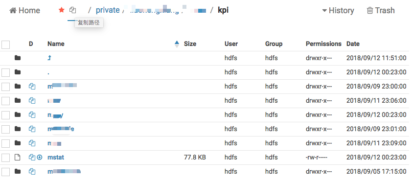

# Tampermonkey插件 - Hue文件浏览器的”收藏夹“扩展

默认的 history 功能忒难用。 =_=!!

最近刚好接触 [Tampermonkey](https://tampermonkey.net/) ，遂自行扩展一下。

----

示例:

* 【收藏夹】

	

	* 支持 上级路径 跳转。配色就没有浪费太多精力了

* 【文件列表】

   

	* 主路径 左侧是有 【添加/移除收藏夹】、【复制路径到剪贴板】
		* 复制路径时，如果 列表中 有选择文件，则使用选择的文件路径（多个文件时使用 换行符 '\n' 连接），默认使用 当前目录
	* 列表中，可以【复制路径】，如果是文件，可以使用【直接下载】按钮
		* 重新格式化了 文件修改时间，按 "yyyy-MM-dd hh:mm:ss" 格式；

